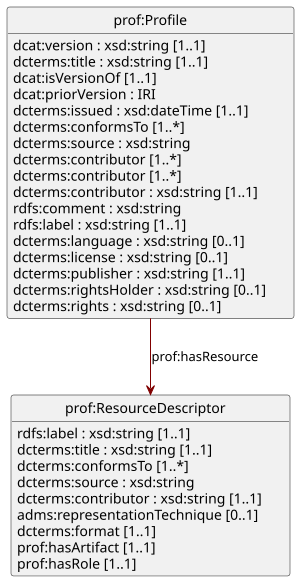

= PROF-AP-CIM
:toc: left
:sectnums:
:source-highlighter: highlight.js
:stylesheet: cimug.style.css

Application profile of "`The Profiles Vocabulary`" (PROF) for describing CIM profiles.

'''

[#metadata]
--
URI:: https://prof-ap-cim.ucaiug.io/1.0#[https://prof-ap-cim.ucaiug.io/1.0#]
Version:: 1.0
Version of:: https://prof-ap-cim.ucaiug.io#[https://prof-ap-cim.ucaiug.io#]
Conforms to:: https://www.w3.org/TR/dx-prof/
Artifacts:: link:./prof_ap_cim.shacl.ttl[SHACL (Turtle),window=read-later] | link:./prof_ap_cim.linkml.yml[LinkML (YAML),window=read-later] | link:./prof_ap_cim.context.jsonld[JSON-LD context (JSON-LD),window=read-later]
--

== Introduction

This is an application profile of PROF for defining CIM profiles.

== Status
#TODO#.

== License
#TODO#.

== Conformance
#TODO#.

== Terminology
#TODO#.

== Schema

.Schema

=== Class: Profile
[horizontal]
URI:: http://www.w3.org/ns/dx/prof/Profile[`prof:Profile`]

A specification that constrains, extends, combines, or provides guidance or explanation about the usage of other specifications. This definition includes what are sometimes called "`application profiles`", "`metadata application profiles`", or "`metadata profiles`".

.Profile properties
[cols="1,1,3"]
|===
| Property | Type | Description

| http://www.w3.org/ns/dcat#version[`version`, title=dcat:version]
a|
[unstyled]
* `string`
* (1)
    
| The version indicator (name or identifier) of a resource.

| http://purl.org/dc/terms/title[`title`, title=dcterms:title]
a|
[unstyled]
* `string`
* (1)
    
| A name given to the resource.

| http://www.w3.org/ns/dcat#isVersionOf[`is_version_of`, title=dcat:isVersionOf]
a|
[unstyled]
* `uriorcurie`
* (1)
    
| A related resource of which the described resource is a version, edition, or adaptation.

| http://www.w3.org/ns/dcat#previousVersion[`previous_version`, title=dcat:previousVersion]
a|
[unstyled]
* `uriorcurie`
* (0..*)
    
| The previous version of a resource in a lineage.

| http://purl.org/dc/terms/issued[`issued`, title=dcterms:issued]
a|
[unstyled]
* `datetime`
* (1)
    
| Date of formal issuance of the resource.

| http://purl.org/dc/terms/conformsTo[`conforms_to`, title=dcterms:conformsTo]
a|
[unstyled]
* `uriorcurie`
* (1..*)
    
| An established standard to which the described resource conforms.

| http://purl.org/dc/terms/source[`source`, title=dcterms:source]
a|
[unstyled]
* `string`
* (0..*)
    
| A related resource from which the described resource is derived.

| http://purl.org/dc/terms/contributor[`contributor`, title=dcterms:contributor]
a|
[unstyled]
* `uriorcurie`
* (1..*)
    
| An entity responsible for making contributions to the resource.

| http://purl.org/dc/terms/contributor[`creator`, title=dcterms:contributor]
a|
[unstyled]
* `uriorcurie`
* (1..*)
    
| An entity primarily responsible for making the resource.

| http://purl.org/dc/terms/contributor[`description`, title=dcterms:contributor]
a|
[unstyled]
* `string`
* (1)
    
| An account of the resource.

| http://www.w3.org/2000/01/rdf-schema#comment[`comment`, title=rdfs:comment]
a|
[unstyled]
* `string`
* (0..*)
    
| A description of the subject resource.

| http://www.w3.org/2000/01/rdf-schema#label[`label`, title=rdfs:label]
a|
[unstyled]
* `string`
* (1)
    
| A human-readable name for the subject.

| http://purl.org/dc/terms/language[`language`, title=dcterms:language]
a|
[unstyled]
* `string`
* (0..1)
    
| A language of the resource.

| http://purl.org/dc/terms/license[`license`, title=dcterms:license]
a|
[unstyled]
* `string`
* (0..1)
    
| A legal document giving official permission to do something with the resource.

| http://purl.org/dc/terms/publisher[`publisher`, title=dcterms:publisher]
a|
[unstyled]
* `string`
* (1)
    
| An entity responsible for making the resource available.

| http://purl.org/dc/terms/rightsHolder[`rights_holder`, title=dcterms:rightsHolder]
a|
[unstyled]
* `string`
* (0..1)
    
| A person or organization owning or managing rights over the resource.

| http://purl.org/dc/terms/rights[`rights`, title=dcterms:rights]
a|
[unstyled]
* `string`
* (0..1)
    
| Information about rights held in and over the resource.

| http://www.w3.org/ns/dx/prof/hasResource[`resource`, title=prof:hasResource]
a|
[unstyled]
* `ProfileResource`
* (0..*)
    
| A resource which describes the nature of an artifact and the role it plays in relation to the profile.

|===

=== Class: ProfileResource
[horizontal]
URI:: http://www.w3.org/ns/dx/prof/ResourceDescriptor[`prof:ResourceDescriptor`]

A resource that defines an aspect - a particular part or feature - of a profile.

.ProfileResource properties
[cols="1,1,3"]
|===
| Property | Type | Description

| http://www.w3.org/2000/01/rdf-schema#label[`label`, title=rdfs:label]
a|
[unstyled]
* `string`
* (1)
    
| A human-readable name for the subject.

| http://purl.org/dc/terms/title[`title`, title=dcterms:title]
a|
[unstyled]
* `string`
* (1)
    
| A name given to the resource.

| http://purl.org/dc/terms/conformsTo[`conforms_to`, title=dcterms:conformsTo]
a|
[unstyled]
* `uriorcurie`
* (1..*)
    
| An established standard to which the described resource conforms.

| http://purl.org/dc/terms/source[`source`, title=dcterms:source]
a|
[unstyled]
* `string`
* (0..*)
    
| A related resource from which the described resource is derived.

| http://purl.org/dc/terms/contributor[`description`, title=dcterms:contributor]
a|
[unstyled]
* `string`
* (1)
    
| An account of the resource.

| http://www.w3.org/ns/adms#representationTechnique[`representation_technique`, title=adms:representationTechnique]
a|
[unstyled]
* `RepresentationTechnique`
* (0..1)
    
| More information about the format in which an asset distribution is released. This is different from the file format as, for example, a ZIP file (file format) could contain an XML schema (representation technique).

| http://purl.org/dc/terms/format[`format`, title=dcterms:format]
a|
[unstyled]
* `RepresentationFormat`
* (1)
    
| The file format, physical medium, or dimensions of the resource.

| http://www.w3.org/ns/dx/prof/hasArtifact[`artifact`, title=prof:hasArtifact]
a|
[unstyled]
* `uriorcurie`
* (1)
    
| The URL of a downloadable file with particulars such as its format and role indicated by the resource descriptor.

| http://www.w3.org/ns/dx/prof/hasRole[`role`, title=prof:hasRole]
a|
[unstyled]
* `ProfileResourceRole`
* (1)
    
| A description of a resource that defines an aspect - a particular part, feature or role - of a profile.

|===

=== Enumeration: RepresentationTechnique
[horizontal]
URI:: https://cim.ucaiug.io/schema-extensions#RepresentationTechnique[`cims:RepresentationTechnique`]

More information about the format in which an asset distribution is released. This is different from the file format as, for example, a ZIP file (file format) could contain an XML schema (representation technique).

.RepresentationTechnique properties
[cols="1,3"]
|===
| Value | Description

| https://cim.ucaiug.io/schema-extensions#linkml[`LINKML`, title=cims:linkml]
| The LinkML data modeling language.

| https://cim.ucaiug.io/schema-extensions#shacl[`SHACL`, title=cims:shacl]
| W3C Shapes Constraints Language.

|===

=== Enumeration: RepresentationFormat
[horizontal]
URI:: https://cim.ucaiug.io/schema-extensions#RepresentationFormat[`cims:RepresentationFormat`]

The file format, physical medium, or dimensions of the resource.

.RepresentationFormat properties
[cols="1,3"]
|===
| Value | Description

| https://cim.ucaiug.io/schema-extensions#yaml[`YAML`, title=cims:yaml]
| Yet Another Markup Language.

| https://cim.ucaiug.io/schema-extensions#turtle[`TURTLE`, title=cims:turtle]
| RDF Turtle.

|===

=== Enumeration: ProfileResourceRole
[horizontal]
URI:: https://cim.ucaiug.io/schema-extensions#ProfileResourceRole[`cims:ProfileResourceRole`]

A description of a resource that defines an aspect - a particular part, feature or role - of a profile.

.ProfileResourceRole properties
[cols="1,3"]
|===
| Value | Description

| http://www.w3.org/ns/dx/prof/role/constraints[`CONSTRAINTS`, title=role:constraints]
| Descriptions of obligations, limitations or extensions that the profile defines.

| http://www.w3.org/ns/dx/prof/role/vocabulary[`VOCABULARY`, title=role:vocabulary]
| Defines terms used in the profile specification.

| http://www.w3.org/ns/dx/prof/role/specification[`SPECIFICATION`, title=role:specification]
| Defining the profile in human-readable form.

|===

[nonum]
== Appendix A: Diagram Layout profile example

Any RDF serialization will do for profile instances, but it is recommended to make us of the link:./prof_ap_cim.context.jsonld[JSON-LD context,window=read-later]
and write using YAML.

._Diagram Layout_ profile (YAML source code)
[%collapsible]
====
[source,yaml]
----
include::src/examples/diagram_layout_ap.yml[]
----
====

Note how the user does not need to write any URIs or CURIEs by hand. Moreover, all the `@` characters which indicate special JSON-LD syntax have been aliased
such that the user won't be confused by them.

This YAML can trivially, automatically be converted to JSON, rendering a valid JSON-LD serialization of the profile instance:

._Diagram Layout_ profile (JSON-LD source code)
[%collapsible]
====
[source,json]
----
include::src/examples/diagram_layout_ap.jsonld[]
----
====

[nonum]
== Appendix B: Validating profiles